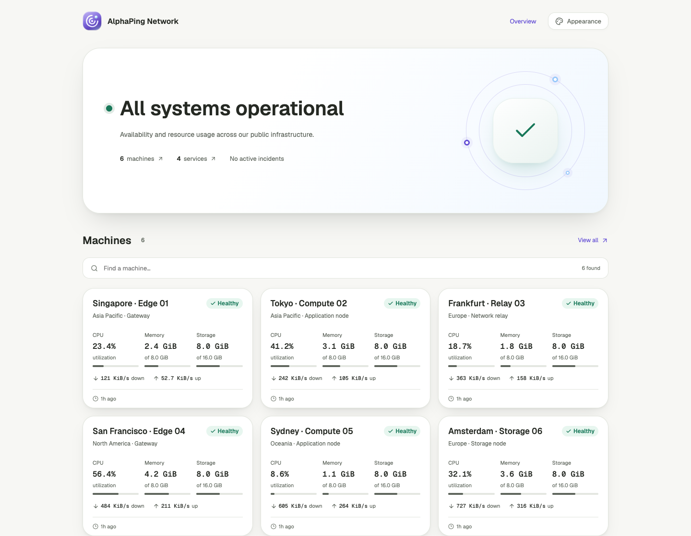

<p align="center">
  
</p>

<h1 align="center">AlphaPing</h1>

<p align="center">
  Infrastructure monitoring with a page worth sharing.<br />
  A lightweight Rust Agent. A Cloudflare control plane. Your own public status page.
</p>

<p align="center">
  <a href="https://github.com/BackRunner/alphaping/actions/workflows/ci.yml"></a>
  <a href="https://github.com/BackRunner/alphaping/actions/workflows/agent-ci.yml"></a>
  <a href="LICENSE"></a>
</p>

<p align="center">
  <a href="#get-started">Get started</a> ·
  <a href="#agent-builds">Agent builds</a> ·
  <a href="#appearance">Appearance</a> ·
  <a href="#documentation">Documentation</a>
</p>

<picture>
  <source media="(prefers-color-scheme: dark)" srcset="docs/images/dashboard-dark.png" />
  <source media="(prefers-color-scheme: light)" srcset="docs/images/dashboard-light.png" />
  
</picture>

<p align="center"><sub>Public dashboard preview with synthetic data. Light and dark themes included.</sub></p>

AlphaPing monitors machines, containers and network services from a self-hosted
control plane on Cloudflare Workers. Share selected status with visitors while
keeping infrastructure details behind resource-level permissions.

**Early development:** deployment is currently manual. Signed production Agent
releases require the update-root setup described in the release guide. See the
[verification record](docs/reviews/2026-09-08-final-verification.md) for tested
behavior and remaining platform coverage.

## What you can do

|                                |                                                                                                                               |
| ------------------------------ | ----------------------------------------------------------------------------------------------------------------------------- |
| **Monitor your hosts**         | CPU, memory, disks, networking and container inventory, collected by a Rust Agent with a bounded local SQLite spool.          |
| **Check your services**        | HTTP and TCP checks from Cloudflare; HTTP, TCP and ICMP probes from your Agents.                                              |
| **Share a status page**        | Public machine and service views, incidents and announcements, with explicit control over which data is published.            |
| **See changes as they happen** | Ten-second live snapshots while a viewer is connected, with durable history and a polling fallback.                           |
| **Make it yours**              | Five color palettes, light/dark modes, layout density, a custom title and a replaceable Logo.                                 |
| **Stay in control**            | Resource-level access, encrypted reports, signed Agent updates, bounded retention and documented Cloudflare cost assumptions. |

## Get started

### Host the control plane

AlphaPing uses Cloudflare Workers, two D1 databases and a WebSocket Durable Object.
R2 holds explicit exports and backups. The frontend is SvelteKit; the Agent and
ingest service are Rust.

1. Clone this repository and install the [development prerequisites](#development).
2. Start from the committed `wrangler.*.template.toml` and `.dev.vars.example`
   files. Provision your D1 databases, bindings and secrets in your own account.
3. Apply the D1 migrations, build the applications and inspect the deployment plan:

   ```bash
   pnpm workers:list
   pnpm workers:deploy --all --env production --dry-run
   ```

4. Deploy with your real configurations, then open `/setup` to create the first
   workspace. Follow the [architecture](.agents/02-architecture.md) and
   [security configuration](.agents/05-agent-protocol-security.md) guides.

Real Wrangler configurations, local secrets and databases are ignored by Git.
Existing installations need CONTROL_DB migration `0024_dashboard_appearance.sql`
before deploying the appearance settings.

### Install an Agent

After configuring a signed Agent release, create a machine in the control plane,
generate a short-lived enrollment token and copy its Shell or PowerShell command.
The command verifies the downloaded installer; the installer verifies the binary
against the control plane's HTTPS manifest before enrollment and service startup.
Existing enrollments are preserved. Subsequent upgrades use signed metadata.

| Platform                  | Architectures               | Service           |
| ------------------------- | --------------------------- | ----------------- |
| Linux                     | x86_64, ARM64 · static musl | systemd or OpenRC |
| macOS 11+                 | Intel, Apple silicon        | launchd           |
| Windows 10 / Server 2016+ | x64, ARM64                  | Windows Service   |

See the [installation and recovery guide](.agents/14-agent-installation.md) for
privileges, PowerShell requirements and platform limitations. CI builds validate
native binaries; service installation and restart need separate platform testing.

## Agent builds

[Agent CI](https://github.com/BackRunner/alphaping/actions/workflows/agent-ci.yml)
tests and compiles all six OS/architecture combinations on native GitHub runners.
It runs when Agent inputs change on `main` or a pull request, and can also be
started manually. Open a successful run's **Artifacts** section to download a
platform build with SHA-256 checksums, an SPDX SBOM, source information and license
notices. CI artifacts are retained for seven days.

CI binaries are evaluation builds with automatic updates disabled. The separate
[release workflow](.github/workflows/agent-release.yml) requires a configured
public update root, verifies all six packages and assembles a release bundle.
Production publication follows the
[signing and update guide](.agents/12-release-and-agent-updates.md); private signing
keys stay outside the repository and ordinary CI jobs.

## Appearance

Open **Admin → Appearance** to choose Iris, Ocean, Mint, Sunset or Rose, set a
light/dark default, adjust density and replace the navbar Logo with your own image.
Changes apply across the public dashboard and resource pages. Visitors can change
their own theme preferences locally and reset to the site's defaults.

Custom domains can open a public dashboard, machine or service directly at `/`.
Configure `DOMAIN_ROUTES_JSON` in your Web Worker; guest hostnames reject login
and management routes. [Domain routing examples](docs/domain-routing.md).

## Built for modest infrastructure

Reports keep every ten-second sample in five-minute D1 blocks. Latest-state and
rollup tables handle routine reads; live frames do not write telemetry to D1.
The Agent persists unacknowledged reports locally and retries with capped backoff.

The current **30-machine + 30-check** cost model fits the Cloudflare Workers Paid
included usage at an estimated **$5/month**. Larger fleets, retention and public
traffic change that estimate; consult the [cost model](.agents/06-cloudflare-storage-cost.md).

Transport uses TLS 1.3 hybrid `X25519MLKEM768` key agreement plus authenticated,
encrypted protobuf envelopes. Public views use explicit data projections, and
Agent updates verify signatures, expiry, hashes and platform compatibility.

## Development

Use Node.js 22.12+, pnpm 12.3.4 and Rust 1.96 with the
`wasm32-unknown-unknown` target. CI uses Node.js 24. TypeScript is on **6.x**.

```bash
git clone https://github.com/BackRunner/alphaping.git
cd alphaping
pnpm install --frozen-lockfile
pnpm verify
node scripts/test-ingest-e2e.mjs
```

`pnpm verify` includes formatting, lint, types, tests, D1 migration checks, cost
checks, Rust checks, Agent resource measurement, production builds, Web E2E and
Worker deployment dry-runs. It does not deploy your application.

```text
apps/web               SvelteKit control plane and public pages
apps/docs              svedocs landing page and public documentation
crates/agent           Rust monitoring Agent
crates/*               Shared crypto, protocol and runtime adapters
workers/ingest         Rust/Wasm telemetry ingestion
workers/live           Hibernating WebSocket hub
workers/checks         Scheduled service checks
workers/notifications  Notification delivery
workers/retention      Bounded retention and cleanup
packages               Shared contracts, authorization and D1 repositories
proto                  Canonical protobuf definitions
```

## Documentation

The documentation site lives in [`apps/docs`](apps/docs), with a custom AlphaPing
landing page, floating navigation, light/dark theme and local search. All pages
are available in Chinese and English. Run `pnpm docs:dev` and open
`http://localhost:4174` (Chinese) or `http://localhost:4174/en` (English).
Use `pnpm docs:check` and `pnpm docs:build` to validate it, including strict
translation coverage.
See the [site guide](apps/docs/README.md) for content authoring and independent
Cloudflare deployment.

- [Project specifications and roadmap](.agents/README.md)
- [Agent installation and compatibility](.agents/14-agent-installation.md)
- [Release signing and automatic updates](.agents/12-release-and-agent-updates.md)
- [D1 backup and recovery](.agents/13-d1-backup-and-recovery.md)
- [UI review and screenshots](docs/reviews/2026-09-08-glass-logo.md)

Contributions are welcome. Read [CONTRIBUTING.md](CONTRIBUTING.md) and the
[Code of Conduct](CODE_OF_CONDUCT.md). Report vulnerabilities through
[private security reporting](https://github.com/BackRunner/alphaping/security/advisories/new)
or follow [SECURITY.md](SECURITY.md).

## License

Copyright 2026 AlphaPing contributors. Licensed under **Apache License 2.0**.
See [LICENSE](LICENSE), [NOTICE](NOTICE) and
[third-party notices](THIRD_PARTY_NOTICES.md).
