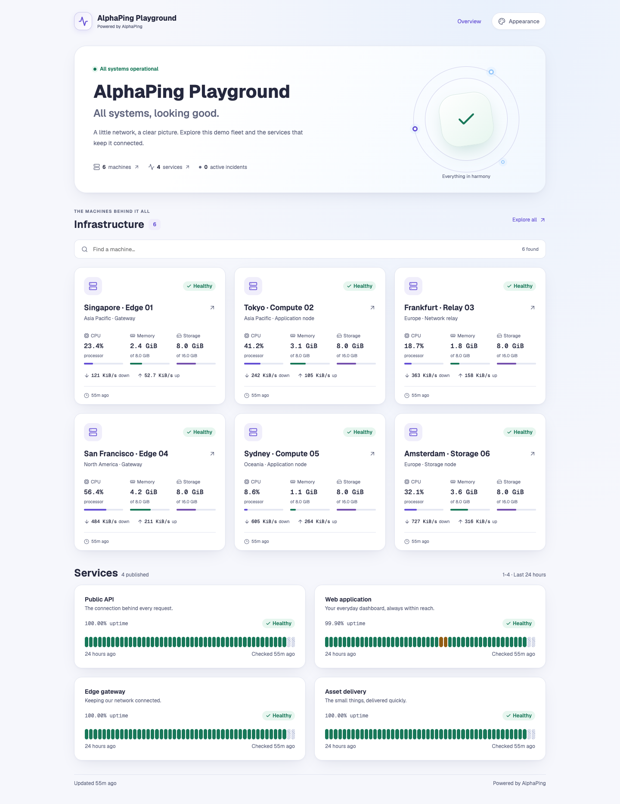

# AlphaPing 公开探针与主题设计重构（2026-09-08）

本轮按用户新的视觉方向完成设计重构：现代、明快、面向个人和游客，提供可定制的公开探针体验。此前“紧凑控制台风格已经足够”的评价不再作为当前设计依据；[旧版检查记录](2026-09-08-frontend.md)及截图保留为历史。

## 实际页面

下列截图来自真实 Chromium 打开的本地 Cloudflare Worker production build。工作区、机器、服务及历史记录均为合成测试数据，不含生产数据、安装令牌或登录凭据。首页轨道图形表达当前汇总状态，不表示虚构的监控趋势。

| 场景               | 截图                                                                                                                           |
| ------------------ | ------------------------------------------------------------------------------------------------------------------------------ |
| 手机首屏           | [390px 手机截图](assets/2026-09-08-redesign/public-mobile.png) · [完整页面](assets/2026-09-08-redesign/public-mobile-full.png) |
| 深色主题与游客定制 | [Mint 深色、紧凑布局、主题面板](assets/2026-09-08-redesign/public-mint-dark.png)                                               |
| 管理员主题编辑     | [站点配置与实时预览](assets/2026-09-08-redesign/appearance-admin.png)                                                          |
| 公开机器详情       | [深色指标卡片](assets/2026-09-08-redesign/machine-detail-dark.png)                                                             |
| 公开服务详情       | [手机可用率与历史](assets/2026-09-08-redesign/service-detail-mobile.png)                                                       |
| 管理控制台         | [总览、浮动侧栏与指标卡片](assets/2026-09-08-redesign/console-overview.png)                                                    |

## 改动

- 全局 Prism 视觉：柔和明暗表面、静态品牌渐变、圆角、层次阴影、自托管 Geist 字体和更清晰的字号层级。控制台、登录和现有管理页面共同使用这些 tokens。
- 公开首页：站点品牌、整体状态、真实公开资源计数、三列/两列/单列机器卡片、搜索、服务时间线、公告和事件。首页最多展示 12 张机器卡片，完整集合进入已有分页列表。
- 公开机器与服务详情：统一导航、站点标题、状态面板和大字号指标。没有公开详细指标时保留 summary-only 状态，不绕过原有投影权限。
- 管理员可在 **Admin → Appearance** 配置标题、介绍、Iris/Ocean/Mint/Sunset/Rose 配色、明暗或跟随设备、舒适/紧凑布局，并立即查看示意预览。
- 游客可以独立选择配色、明暗和密度，刷新、跨公开路由和同源多标签页保持偏好；可重置为站点默认。浏览器禁用存储时仍可在当前页面切换。
- 时间线支持键盘方向键、Home/End、鼠标和触屏提示。修复首次触屏点击导致提示立即关闭，提示可悬停并用 Escape 关闭。
- 移动端修复机器 grid 最小宽度、搜索/排序排布和胶囊默认 padding 导致的实际裁切。公开排序菜单继承所在站点主题；共享下拉组件补齐 combobox、listbox 名称和控制关联，修复展开态 ARIA 错误。机器列表的自动筛选改为等待新选项同步至表单后提交，修复选择 Name 却仍提交 priority 的旧值问题，公开页和控制台均覆盖。

主题定制涵盖公开首页、机器列表、机器详情、服务详情和复用这些页面的自定义域入口。主题配置不开放任意 CSS、HTML、脚本、远程字体或追踪资源。

## 安全、成本与兼容

`SiteAppearance` 合约只允许五个配置字段，校验枚举和文本长度，剥离未知字段。每份序列化配置上限 2 KiB；标题最多 80 字符，介绍最多 240 字符。公开快照也执行安全投影，旧快照缺少 appearance 时继续兼容。

保存配置必须通过 workspace admin 授权，在最终 UPDATE 内再次核查活跃管理员与未删除工作区/仪表盘。条件更新防止读取后并发覆盖，并与审计写入同批提交；拒绝写入不产生成功审计。游客和普通成员不能借由页面或直接服务调用修改设置。

公开读取在已有 dashboard join 中加入一个字段，不新增查询。缓存仍为 30 秒 fresh / 最多 5 分钟故障回退；变更公开策略的语义保持原样。游客偏好写入 localStorage，产生 **0 次 D1 写入**。管理员每次保存进行有界读取、单行更新和审计，审计按既有保留策略清理。

没有增加运行时依赖、轮询、历史预加载、持续装饰动画、DO 存储或 Agent 工作。图形使用 HTML/CSS/SVG，历史继续按需加载。Web Worker dry-run 上传量为 3509.97 KiB，gzip 666.55 KiB；该数值为完整 Worker，不是首页 JavaScript 大小，也不是生产性能基准。

## 验证

- 重构后的第一轮主页面矩阵：15 个页面 × 4 种尺寸 × 明暗两种主题，共 120 组。
- 最后布局和交互修正后，再检查 6 个受影响页面 × 4 种尺寸 × 明暗两种主题，共 48 组；筛选提交修正后另复测两种机器列表的 16 组及明暗模式下四组展开菜单/键盘/实际排序选择。均为 HTTP 200，无页面横向溢出、JavaScript pageerror 或选定 axe 规则违规。
- 五套配色分别在桌面 1440px 与手机 390px 的明暗模式、打开主题面板时检查，共 20 组；另外检查 320px 公开页面和管理主题编辑页。裁切检查排除 Bits UI 有意隐藏的表单桥接输入。
- 实际交互检查包括：主题保存及独立游客读取、刷新/导航持久化、恢复默认、搜索空态、禁用 localStorage、跨标签页同步、排序菜单主题、时间线键盘/悬停/首次触屏点击、移动导航焦点循环/Escape/桌面断点恢复、历史按需请求。
- `pnpm check`：9 个任务通过，Svelte 0 errors / 0 warnings。
- `pnpm lint`、`pnpm format:check`、`git diff --check`：通过。
- `pnpm db:generate:check`：完整迁移链重建后的 schema manifest 一致。
- 主题合约 2 个测试、公开投影 5 个测试、公开快照与主题 CSP 9 个测试、工作区设置 D1 集成 9 个测试通过。后者包含主题默认值/保存/审计、成员及跨工作区拒绝、最终写入前撤销管理员权限三个新增场景。
- Web production build 与 Cloudflare Worker dry-run 通过，未部署远端。

本地检查过程中，曾并行启动 `svelte-kit sync` 与 Vite build，导致服务端和客户端构建标识不一致。已停止该预览、完成串行重建并在浏览器验证交互恢复；后续检查与构建必须顺序运行。仓库 `verify.mjs` 已按顺序执行，无需改变发布脚本。

浏览器精简记录见 [browser-checks.json](assets/2026-09-08-redesign/browser-checks.json)。自动扫描使用 axe 的 WCAG 2 A/AA、2.1 AA、2.2 AA 规则，不等同于完整人工 WCAG 认证。浏览器验证限于 Chromium 与触摸模拟，未完成 Safari、Firefox 或实体设备测试；合成数据不构成大规模负载或真实 Agent 实时推流验收。

## 迁移与部署

1. 按既有部署流程备份 CONTROL_DB。
2. 在 Web 更新前应用 `packages/db/migrations/control/0024_dashboard_appearance.sql`，添加 `dashboards.appearance_json`，旧行默认 `{}`。
3. 部署 Web Worker，检查管理员保存和游客访问；正常缓存窗口内，公开外观变更最多延迟约 30 秒。
4. 若需回滚 Web，可以保留新增列，旧代码会忽略它；不需要删除配置或执行破坏性反向迁移。

本变更不修改 Agent 协议，也不要求发布 Agent、其他 Workers 或新 Cloudflare 资源。以上迁移顺序已准备，本轮没有远端部署。
