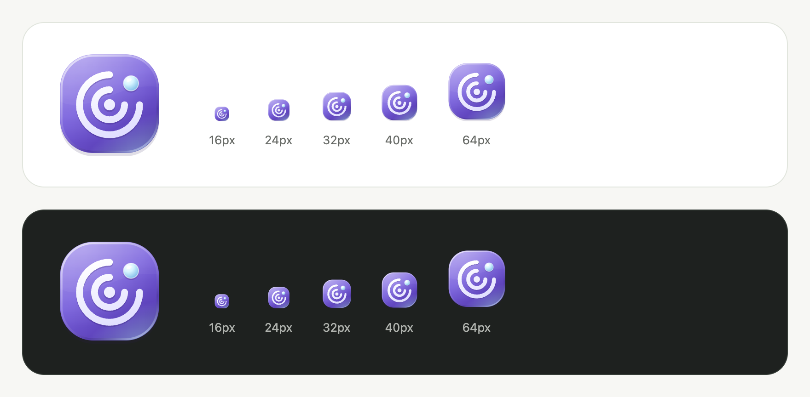

# AlphaPing Logo 玻璃质感（2026-09-08）

保留已接受的探测中心、回波圆弧与信号节点图形，增加紫色渐变底座、玻璃边缘高光、底部淡蓝折射光和轻微浮雕阴影。信号节点使用球面渐变与小面积高光，形成圆润的玻璃质感。

按最终反馈移除外壳左上角的独立高光弧线，保留其余玻璃效果。

全仓检查及端到端结果见 [最终验收](2026-09-08-final-verification.md)。

[实际导航栏](assets/2026-09-08-glass/public-hero.png) · [PNG](assets/2026-09-08-glass/icon.png) · [SVG](../../apps/web/src/lib/assets/alphaping.svg) · [自定义 Logo 设置](2026-09-08-logo.md)

效果由静态 SVG 渐变、轮廓和偏移阴影绘制，文件 3284 字节；没有模糊滤镜、动画、脚本、外链或实时背景采样。导航栏、外观预览、失败回退和 favicon 使用同一默认图形。

验收记录：

- 人工查看 16、24、32、40、64 px 的明暗背景，以及实际页面；小尺寸保持回波轮廓可辨。
- 本地 Chromium 检查公开页与外观设置的桌面/手机和明暗主题，共 8 组，无页面错误、横向溢出或 axe WCAG A/AA 违规，图片均成功解码。
- SVG 解析通过，内部引用均为本文件片段，favicon 与默认 Logo 内容一致；production build / Wrangler dry-run、格式检查与 `git diff --check` 通过。

记录：[资源检查](assets/2026-09-08-glass/asset-check.json)、[页面矩阵](assets/2026-09-08-glass/matrix.json)。页面使用本地合成数据；本轮未验证真机或其他浏览器，未部署远端。
