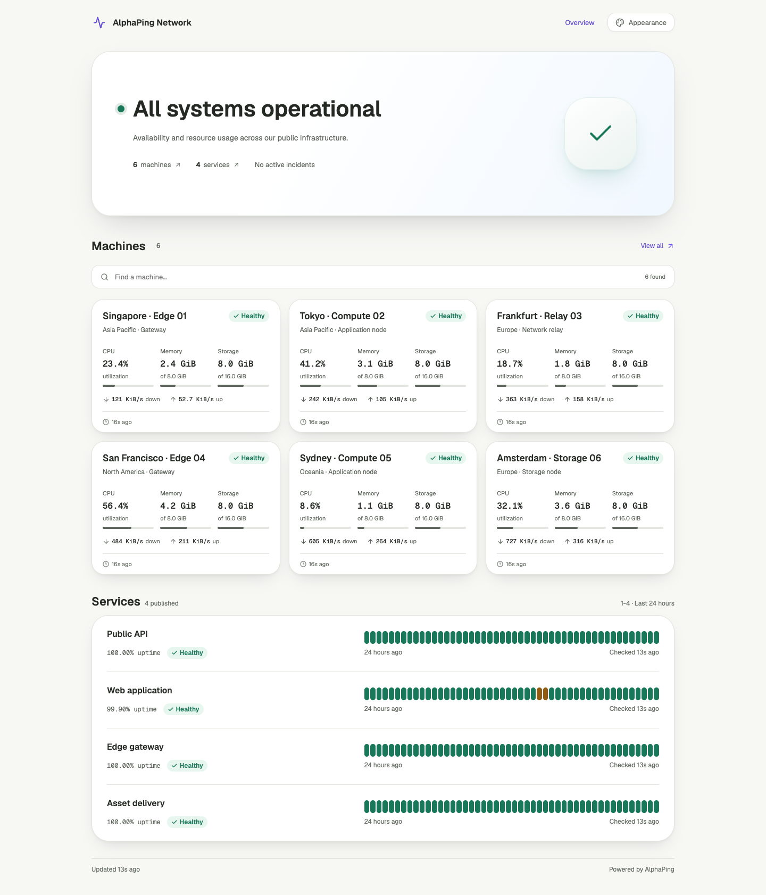

# AlphaPing：宽幅 Hero、大圆角与柔和阴影（2026-09-08）

按最新偏好恢复大块 Hero，并把资源卡、详情标题区、服务列表容器和外观预览统一为更圆润、有层次的表面。本轮视觉方向取代上一轮收紧 Hero、圆角和阴影的做法，继续保留直接文案与清晰的数据排版。

- Hero：桌面最小高度 310 px、圆角 36 px，使用静态柔和渐变和随真实状态变化的图标；手机圆角 28 px，隐藏右侧图标，为标题和资源摘要留出空间。
- 共享形状：卡片 24 px、面板 32 px、控件 14 px、按钮 12 px。
- 阴影：接触阴影与柔和扩散阴影叠加，明暗主题分别设定强度；卡片悬停保持位置稳定。
- 服务仍用连续行和对齐的历史轨道，机器卡片保持设备名称、状态和指标的清晰层级。
- 五套配色、明暗模式和舒适/紧凑布局继续可用，站点默认和游客个人设置沿用现有交互。

| 页面             | 截图                                                                                                                                                                            |
| ---------------- | ------------------------------------------------------------------------------------------------------------------------------------------------------------------------------- |
| 公开首页         | [桌面浅色](assets/2026-09-08-hero/public-desktop-light.png) · [桌面深色](assets/2026-09-08-hero/public-desktop-dark.png) · [手机首屏](assets/2026-09-08-hero/public-mobile.png) |
| 机器离线时的首页 | [异常状态 Hero](assets/2026-09-08-hero/public-offline.png)                                                                                                                      |
| 外观设置         | [管理员预览](assets/2026-09-08-hero/appearance-admin.png)                                                                                                                       |

## 验证

使用本地 Worker 和合成数据，在 Chromium 中检查实际页面，并人工查看桌面、手机、深色、详情和外观预览截图：

- 公开首页、机器列表、机器详情、服务详情、外观设置、控制台总览、游客登录页，共 7 个页面 × 4 种尺寸（1440×900、1280×720、768×1024、390×844）× 明暗模式，共 56 组检查。全部 HTTP 200，无页面脚本错误、横向溢出或 axe WCAG A/AA 违规。
- 第一轮首页使用上报过期的离线样例；刷新本地合成数据时间戳后，正常状态首页额外通过 8 组尺寸/主题检查。
- 五套配色 × 明暗模式 × 桌面/手机，共 20 组主题面板检查；320 px 的四个公开页面和外观设置、深色排序下拉框均无溢出或 axe 违规。
- 主题重置、Escape 焦点返回、跨标签偏好同步、禁用 localStorage 时切换主题、时间线键盘/悬停/触屏交互、移动导航焦点循环及跨断点恢复、历史图表按需请求均通过。
- `pnpm --filter @alphaping/web check`：0 errors / 0 warnings；`pnpm lint` 通过。类型检查与构建按顺序运行。
- Web production build 与 Wrangler dry-run 通过，上传体积 3507.07 KiB，gzip 665.76 KiB。
- `pnpm format:check` 与 `git diff --check` 通过。

检查记录：[页面矩阵](assets/2026-09-08-hero/matrix.json)、[正常状态首页](assets/2026-09-08-hero/healthy.json)、[主题与交互](assets/2026-09-08-hero/interactions.json)。移动尺寸和触屏使用浏览器模拟，本轮未执行 Safari/Firefox 或真机检查；axe 结果不等同于完整可访问性认证。

本轮仅调整 UI 样式和状态图标，没有新增运行时依赖、持续动画或网络请求，也未改变公开权限、缓存、D1 查询/写入路径和 Agent 协议。截图仅使用本地合成数据，未部署到远端。
