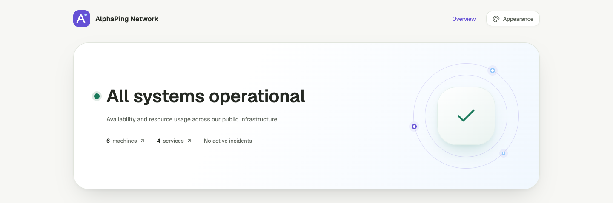

# AlphaPing 导航栏 Logo 与替换设置（2026-09-08）

后续默认 Logo 已更新为[探测与回波图形标志](2026-09-08-symbol.md)，本页保留自定义功能的实现与验证记录。

导航栏使用新绘制的 A 字母与信号圆点标志，圆角方形底座沿用现有视觉语言；favicon 同步更新。Hero 轨道下方不显示说明文字。

[手机效果](assets/2026-09-08-logo/public-mobile.png) · [外观设置](assets/2026-09-08-logo/appearance-admin.png) · [SVG 源文件](../../apps/web/src/lib/assets/alphaping.svg)

## 替换 Logo

在 **Admin → Appearance → Logo image address** 填入公开 HTTPS 图片地址或站内路径（例如 `/brand/logo.svg`），预览后保存。四个公开路由共用这份设置，游客个人配色不会覆盖站点 Logo。点击 **Use default logo** 并保存即可恢复 AlphaPing 标志。

预览在停止输入 400 ms 后加载，避免逐字请求。图片保留宽高比，在固定尺寸内显示；失败时显示默认标志，管理员预览同时给出就地提示。图片在页面完成加载或 hydration 前已经失败的情况也会检查。

## 边界与成本

- `logoUrl` 默认为空，最多 512 字符，保存到既有 `appearance_json`；整体仍限定 2 KiB。旧设置与旧公开快照缺少该字段时兼容默认 Logo，无新增数据库迁移。
- 复用管理员授权、最终写入时权限复核和审计。游客和成员不能修改 Logo，非法地址在写入之前被拒绝。
- 仅允许 HTTPS URL 或站内绝对路径，拒绝脚本/data URL、HTTP、协议相对地址、凭据、控制字符和超长输入；公开快照重新执行校验。
- 自定义 Logo 只通过 `img` 加载，不插入 SVG/HTML 标记。CSP 仅扩展图片来源至 HTTPS，脚本等来源策略沿用现有配置；外部图片请求使用 `no-referrer`。
- Worker 不抓取、代理或存储图片；复用原有配置查询、缓存和写入，没有新增 Cloudflare 资源。图片体积及浏览器缓存由提供图片的站点控制，默认 Logo 是小型本地 SVG。

## 验证

- Contracts 19 个测试、Web 公开快照/工作区设置 D1/CSP 20 个测试通过，包含地址校验、旧配置、公开投影、保存、审计、权限和非法输入拒绝。
- `pnpm check` 9 个任务通过，Web 0 errors / 0 warnings；lint、格式检查、`git diff --check` 和 production build / Wrangler dry-run 通过。
- Chromium 中四个公开页面与外观设置 × 四种尺寸 × 明暗模式，共 40 组：无横向溢出、页面脚本错误或 axe WCAG A/AA 违规。默认 Logo 均成功解码，轨道说明文字为空。
- 浏览器实际验证管理员保存并重新加载、四个游客页面读取新 Logo、站内图片、无 Referer 的 HTTPS 图片、失效回退、非法输入预览阻止、恢复默认、320 px 深色与管理页面，以及游客直接提交被拒绝。

截图和浏览器记录均为本地合成数据；外部示例图片由浏览器测试拦截提供。本轮未验证 Safari、Firefox 或真机，未部署远端。记录：[页面矩阵](assets/2026-09-08-logo/matrix.json)、[Logo 流程](assets/2026-09-08-logo/logo-flows.json)。
