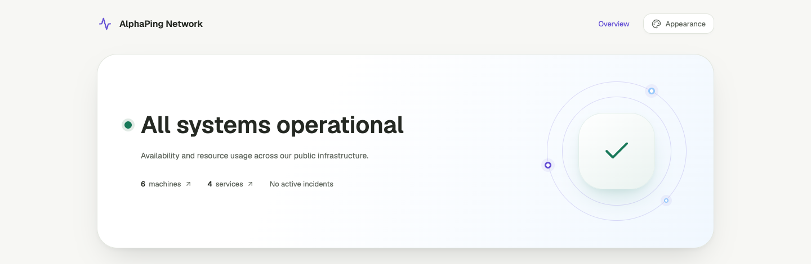

# AlphaPing Hero 轨道效果恢复（2026-09-08）

按用户要求，在大圆角 Hero 中恢复此前的双层细圆环和三个装饰节点。中心图标继续表达真实汇总状态，轨道配色跟随站点或游客主题。

[深色效果](assets/2026-09-08-orbit/hero-dark.png) · [手机首屏](assets/2026-09-08-orbit/public-mobile.png) · [此前 Hero 与圆角调整](2026-09-08-hero.md)

轨道桌面宽 248 px，900 px 及以下缩至 180 px，620 px 及以下隐藏，保留手机文字空间。图形使用静态 CSS，标记 `aria-hidden`，不接收指针操作，不表示遥测趋势或资源数量；没有新增依赖、持续动画、请求或 D1 写入。

本地合成数据与 Chromium 验证：

- 1440、1280、901、900、768、621、620、390、320 px 的明暗模式，共 18 组，HTTP 200，无页面错误、横向溢出或 axe WCAG A/AA 违规，轨道按断点显示/隐藏。
- 五套配色的明暗模式共 10 组，轨道处于 Hero 内且与文字分离；主题切换稳定后无持续动画，减少动态效果偏好下检查通过；主题重置和 Escape 焦点返回正常。
- 人工查看桌面浅色、窄桌面深色、平板和手机截图。浏览器使用设备尺寸模拟，未进行本轮真机或其他浏览器检查。
- Web 类型检查 0 errors / 0 warnings，lint、格式检查、`git diff --check`、production build 和 Wrangler dry-run 通过。

记录：[尺寸矩阵](assets/2026-09-08-orbit/matrix.json)、[主题检查](assets/2026-09-08-orbit/palettes.json)。没有远端部署。
