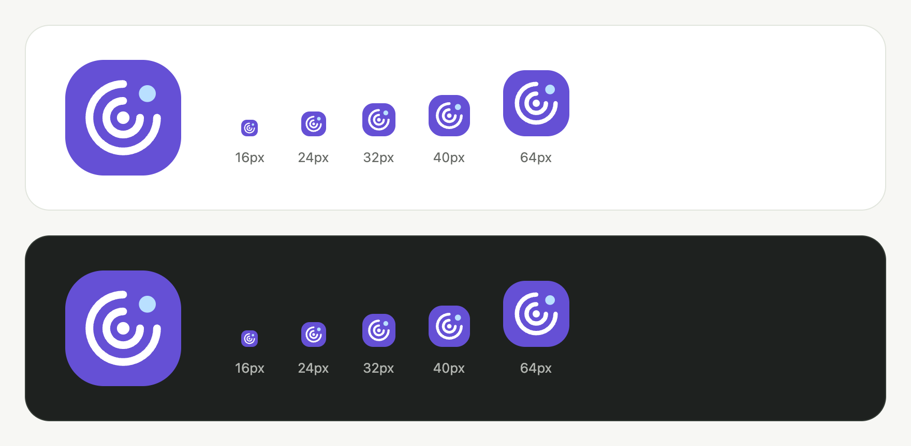

# AlphaPing 图形标志（2026-09-08）

后续已增加[玻璃与立体质感](2026-09-08-glass-logo.md)，本页保留图形确定时的记录。

按用户要求，默认 Logo 改为探测中心、两层回波圆弧与信号节点组成的纯图形标志。导航栏、管理员预览、加载失败时的默认图标和 favicon 共用这一图形，站点名称继续在图标旁独立显示。

[实际导航栏](assets/2026-09-08-symbol/public-hero.png) · [PNG](assets/2026-09-08-symbol/icon.png) · [SVG 源文件](../../apps/web/src/lib/assets/alphaping.svg) · [Logo 自定义说明](2026-09-08-logo.md)

- 默认 SVG 为 373 字节，无文字、字体、脚本、外链或动画；导航栏与 favicon 的 SVG 内容一致。
- 人工检查 16、24、32、40、64 px 图标和明暗背景，以及实际桌面导航栏。
- 本地 Chromium 检查公开页和外观预览的桌面/手机、明暗模式，共 8 组：图片均成功解码，无页面错误、横向溢出或 axe WCAG A/AA 违规。
- Production build / Wrangler dry-run、格式检查和 `git diff --check` 通过。此次仅修改 SVG 与设计记录，Logo 自定义行为沿用上一轮实现。

记录：[图片检查](assets/2026-09-08-symbol/asset-check.json)、[页面检查](assets/2026-09-08-symbol/matrix.json)。页面使用本地合成数据；本轮未进行真机或其他浏览器检查，未部署远端。
