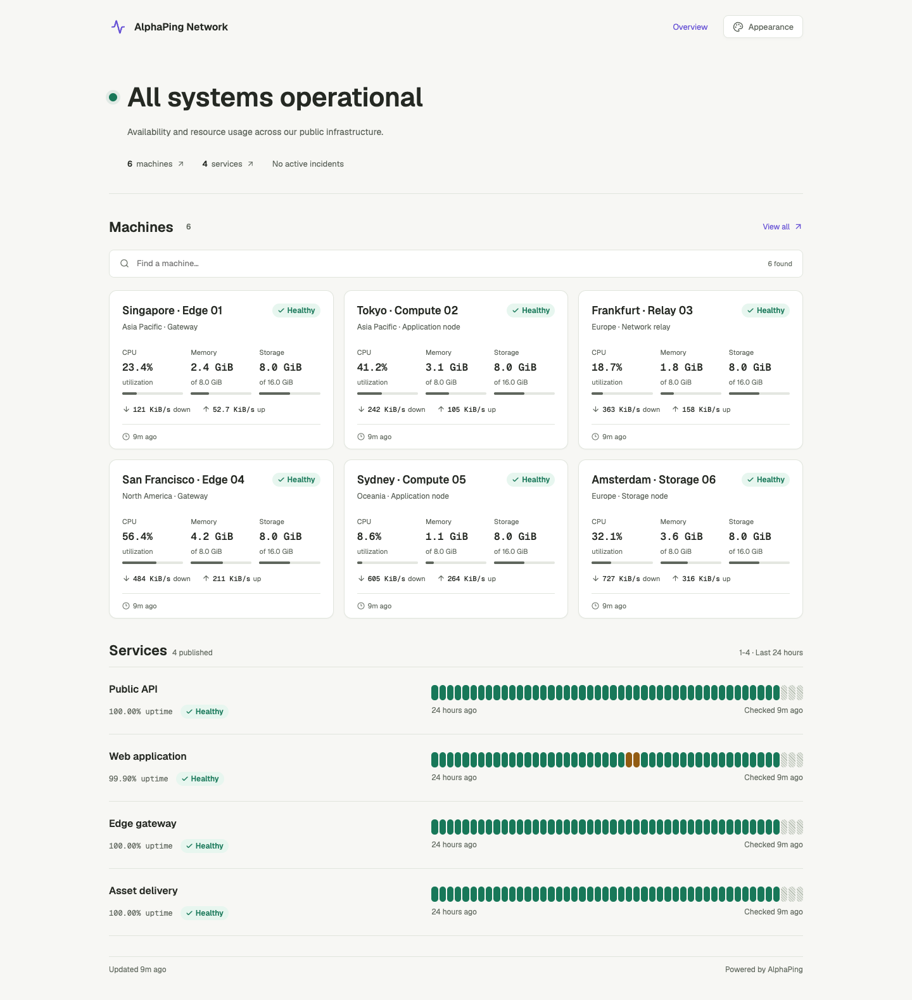

# AlphaPing UI 精修：降低模板感（2026-09-08）

本轮针对“AI slop”观感做了二次精修。保留公开探针的明快和主题定制能力，但去掉容易产生模板感的装饰、口号和同质化卡片。

## 设计调整

- 公开首页从大渐变 Hero 改为直接的状态标题、真实资源摘要和细线分隔。
- 删除轨道、卫星、漂浮图形和重复图标底座；状态只由状态标记、文字和数据表达。
- 机器卡片只保留设备名称、位置、状态、CPU/内存/存储和网络读数，圆角、阴影和 hover 都收敛。
- 服务从两列卡片改为连续列表，名称、可用率和 24 小时历史轨道对齐，便于比较。
- 背景改为中性暖白/炭灰，主题色只作为操作、选中和状态强调，不再染色整页。
- 管理员外观页改为 `Site identity`、`Colors`、`Display defaults`，去掉 “Make it yours”、星光图标、编号步骤等宣传式元素。
- 登录页去掉欢迎口号和氛围渐变，只保留清晰的身份验证表单。
- 共享按钮阴影、控件圆角和公共面板统一收敛，保留既有键盘、移动端和主题交互。

| 页面         | 截图                                                                                                                                 |
| ------------ | ------------------------------------------------------------------------------------------------------------------------------------ |
| 公开首页     | [桌面浅色](assets/2026-09-08-ui-refinement/public-desktop-light.png) · [手机浅色](assets/2026-09-08-ui-refinement/public-mobile.png) |
| 公开机器详情 | [深色详情](assets/2026-09-08-ui-refinement/machine-detail-dark.png)                                                                  |
| 服务列表     | [桌面浅色](assets/2026-09-08-ui-refinement/services-desktop-light.png)                                                               |
| 外观设置     | [管理员预览](assets/2026-09-08-ui-refinement/appearance-admin.png)                                                                   |
| 工作区入口   | [浅色页面](assets/2026-09-08-ui-refinement/workspaces-light.png)                                                                     |

## 验证

- 公开首页、机器列表、机器详情、服务详情、外观页和工作区入口在 1440、1280、768、390 px 以及明暗模式下通过浏览器检查。
- 五套配色的明暗模式、320 px 公开页面、主题面板、键盘/触屏时间线和移动导航均无横向溢出或 axe 违规。
- `pnpm check`：9 个任务通过，Svelte 0 errors / 0 warnings。
- `pnpm lint`、`pnpm format:check`、`git diff --check` 通过。
- Web production build 与 Cloudflare Worker dry-run 通过；最终上传约 3506.24 KiB，gzip 665.61 KiB。
- 本轮没有改动 schema、公开策略、缓存策略、轮询、D1 写入路径或 Agent 协议。

合成浏览器记录保存在 [matrix.log](assets/2026-09-08-ui-refinement/matrix.log) 和 [interactions.log](assets/2026-09-08-ui-refinement/interactions.log)。截图不含生产数据或敏感凭据。没有远端部署。
